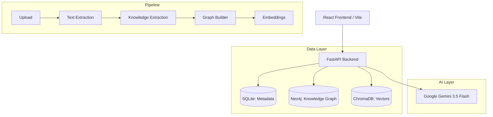

# Industrial Brain: Hackathon Deliverables

## 1. Deployment Guide

### Prerequisites
- Docker & Docker Compose
- Gemini API Key

### Startup Instructions
1. Copy `.env.example` to `.env` and insert your Gemini API Key.
2. Run `docker-compose up --build -d` to spin up the database, backend, and frontend containers.
3. Access the Frontend at `http://localhost:5173`.
4. Access the Backend Swagger at `http://localhost:8000/docs`.

### Running the Demo Script
To automatically clear the database and inject the golden demo dataset:
1. `cd scripts`
2. `python demo_setup.py`
Wait 30-60 seconds for the documents to be fully processed, extracted, graphed, and embedded.

## 2. Architecture & System Diagram

## 3. Known Limitations
- The system currently assumes a local deployment. No remote blob storage (e.g. S3) is implemented for documents.
- Demo mode aggressively drops database tables and resets ChromaDB collections.
- Auth is disabled for the hackathon judging.
- Heavy reliance on single-node Neo4j instance limits ultra-large scale parallel graph insertion.

## 4. Future Roadmap
- **Sprint 11**: Real-time asset streaming data injection (IoT integration).
- **Sprint 12**: RBAC and Enterprise SSO integration.
- **Sprint 13**: High-availability Kubernetes deployments and distributed vector clustering.
